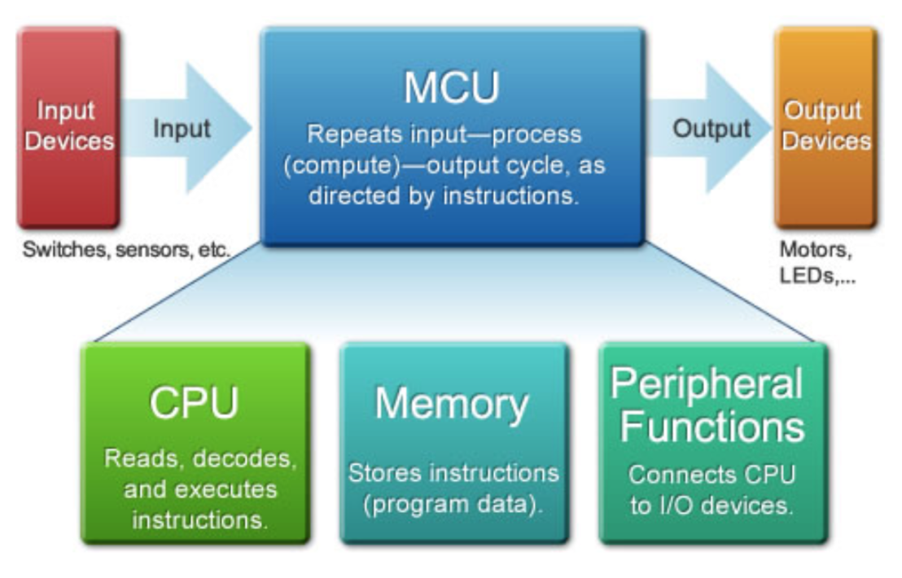
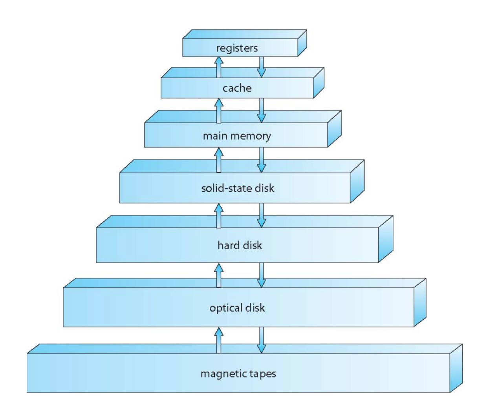
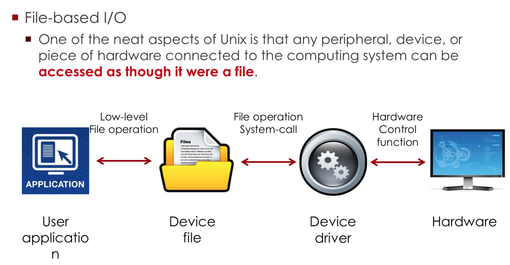
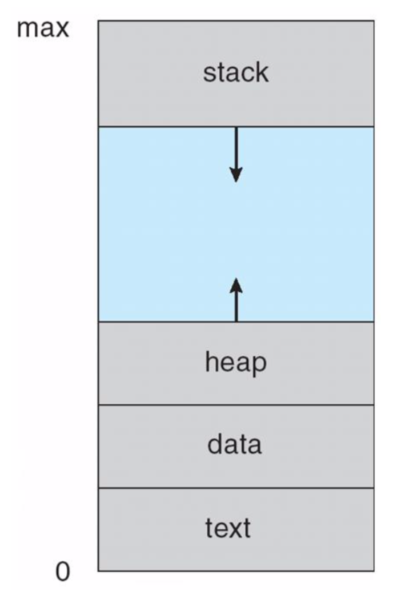
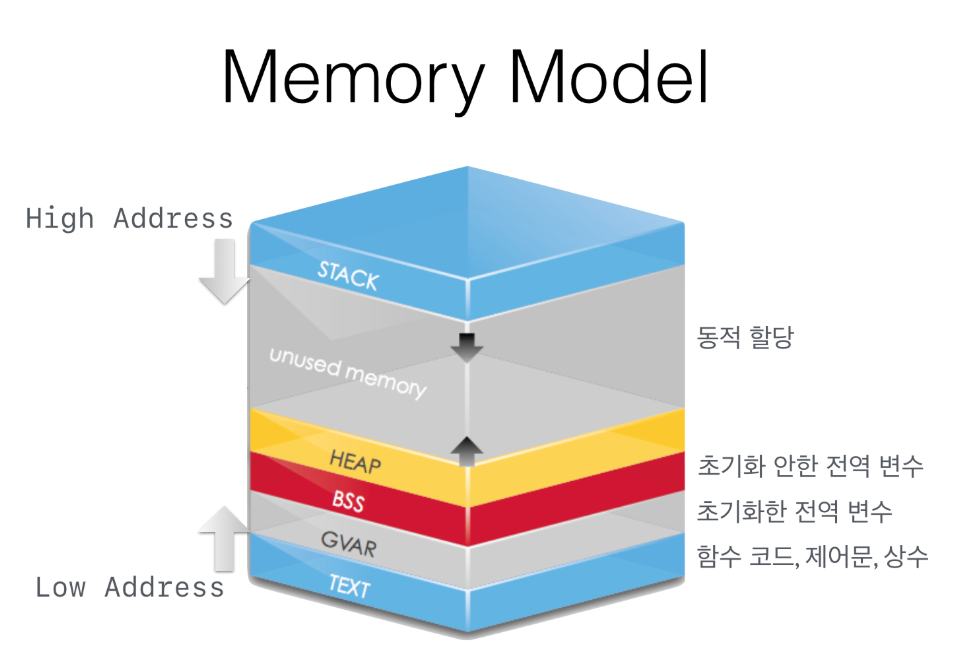
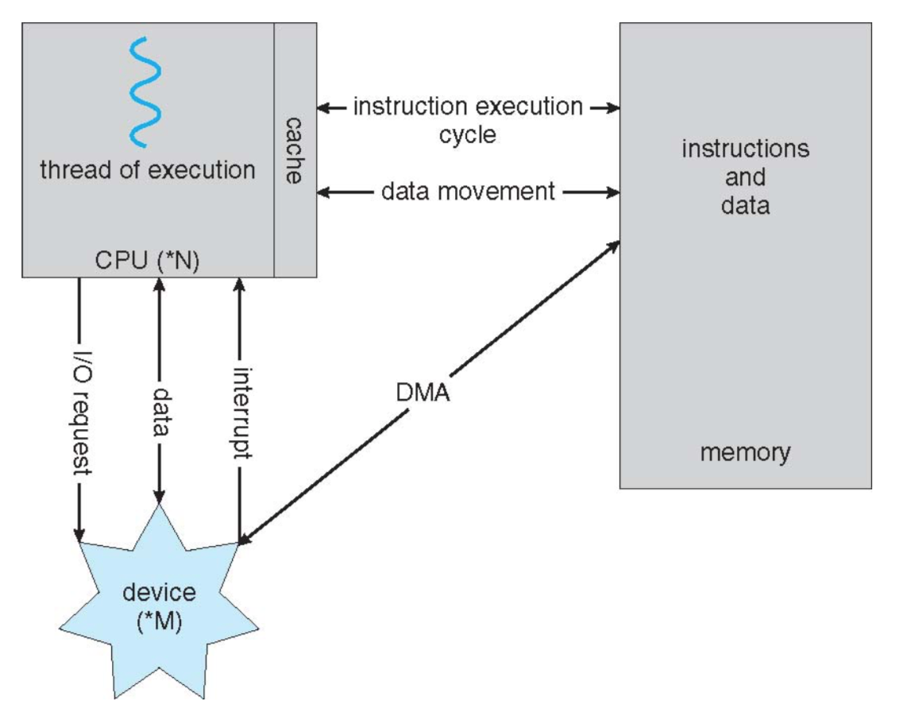

## CS step2 computer simulator

----

컴퓨터의 3 요소는 **input, computer, output이다. **



그럼 입력 장치와 출력 장치를 써왔을텐데 뭘 썼나

**입력장치**

- 천공 카드, 테이프 : 종이에 구멍을 뚫어 데이터를 기록하는 저장 매체이며 구멍의 유무로 0과 1을 표현했다.입력, 출력, 저장매체 등으로 사용했다. 학교 교수님들이 옛날에 쓰던거

- 키보드 : 타자기의 입력부를 컴퓨터에 사용할 수 있게 구현된 입력 장치

- 마우스 : GUI의 사용을 편하게 하기위해 1980년대부터 본격적으로 보급화

  ​		마우스를 대신한 트랙볼, 터치패드 등 또한 있다.

- 용도에 따라 특화된 입력장치 : 게이밍 기어들을 비롯해 다양한 장치들

- 마이크 : 음성 입력


**출력장치**

- 디스플레이 : CRT(브라운관을 이용한 화면), LCD(액정표시기), PDP(플라즈마 표시기), FED(전계방출형 표시기), LED(LCD에서 백라이트를 발광다이오드로 교체) 등 발전해왔다.
- 프린터 : 물리적인 재료들을 이용하여 인쇄하는 장치
- 콤 장치 : 컴퓨터에서 출력되는 내용을 마이크로 필름에 저장
- 스피커 : 음성을 통해 출력


**메모리**

- 메모리는 프로세서가 동작하기 위해 미리(Pro) 작성된(gram) 프로그램 영역과 값을 읽거나 쓰는 데이터 영역으로 나눠짐

**메모리의 계층동작**

메모리를 필요에 따라 여러가지 종류로 나누어 두는 것이다. 

따라서 이러한 구조를 갖고



레지스터와 캐시는 CPU 내부에 위치하여 매우 빠른 접근성을 가진다. 

메모리는 CPU 외부에 존재하고 조금 더 느리다. 아래로 내려갈수록 접근성은 더욱 떨어지고, 정보가 더욱 오래 남아있는다.


**CPU**

CPU는 중앙처리장치를 의미하고, 메모리에 있는 프로그램을 정해진 절차대로 실행한다. 

기본적인 흐름은 비슷하다.


**I/O(Input/Output)**



입력과 출력은 위와 같은 과정을 통해 사용자와 하드웨어가 상호작용을 할 수 있도록 한다.


### 메모리 만들기

- 현대 컴퓨터들은 폰 노이만 아키텍쳐를 기본으로 

- 폰 노이만 아키텍쳐 이전에 있던 하버드 아키텍쳐에서는 메모리를 분리시켜서
  인스트럭션용과 데이터용으로 나눠썼다.

- 하나의 메모리에서 인트스럭션과 데이터 둘다 갖고 오기 때문에 폰 노이만 bottle neck이라고 한다.

  

- **STACK** : 지역변수와 매개변수가 담긴다.  높은 메모리 주소부터 사용하며 compile time에 크기가 결정된다. 
- **HEAP** : 프로그래머가 할당하는 메모리이다. 런타임에 크기가 결정된다. 참조변수, 객체 등 동적할당 공간
- **DATA** : 전역 변수와 static 변수가 할당된다. 프로그램 시작과 동시에 할당되며 프로그램이 종료되어야 메모리에서 사라진다. 아래 그림에 따르면 초기화된 데이터는 **GVAR**(data) 영역에 저장되고, 초기화되지 않은 데이터는 **BSS**(Block Stated Symbol)
- **TEXT** : 코드자체를 구성하는 메모리 영역이므로 프로그램 명령이 위치하는 곳이다. 




**TEXT 영역과 HEAP 영역 할당**

```python
PROGRAM_TEXT = [None]*2**16 #0x0000 부터 0xFFFF 까지
PROGRAM_HEAP = [None]*2**16 #0x10000부터 0x1FFFF 까지

```


**peek()**

```python
def peek(address):
    if 0<=address<=0xFFFF:
        return PROGRAM_TEXT[address]
    elif 0x10000<=address<=0x1FFFF:
        return PROGRAM_HEAP[address-0x10000]
    else:
        return "Error! Out of range exception"
    return "Unexpected ERROR!!!"
```


**locate()**

```python
def locate(program):
    start_location = 0
    for i in range(len(PROGRAM_TEXT)):
        if PROGRAM_TEXT[i] == None:
            start_location = i
            break
    if start_location == 0 and PROGRAM_TEXT[0] != None:
        return "Error! TEXT OVERFLOW!!!"
    for i in range(len(program)):
        PROGRAM_TEXT[start_location + i] = program[i]
    return 0    # locate operated successfully
```


**fetch()**

```python
def fetch(program_count):
    if 0<=program_count + 1<=0xFFFF:   # 1번째 위치한건 index 0에 있으므로 고려할 필요없으면 + 1 지우자
        return PROGRAM_TEXT[program_count + 1]
    else:
        return 'Error! Out of range exception'
    return 'Unexpected ERROR!!!'
```


**load()**

```python
def load(address):
    if 0x10000<=address<=0x1FFFF:
        return PROGRAM_HEAP[address-0x10000]
    else:
        return 'Error! Out of range exception'
    return 'Unexpected ERROR!!!'
```


**store()**

```python
def store(address, data):
    if 0x10000<=address<=0x1FFFF:
        PROGRAM_HEAP[address-0x10000] = data
        return 0
    else:
        return 'Error! Out of range exception'
    return 'Unexpected ERROR!!!'
```


### CPU 만들기!

cpu는 아래와 같이 memory와 device들과 상호작용한다. 



instruction execution cycle이 돌고 있는 와중에도 device들에 대해서 계속해서 interrupt를 받고, 빠른 속도로 subroutine을 왔다 갔다 하며 처리한다. 

쉽게 이해하자면 프로그램을 실행하는 중이라고 마우스와 키보드의 입력이 멈출 순 없기 때문에 그러한 입력이 들어오는 순간 프로그램에서 잠깐 빠져나와서 입력을 처리하고 다시 돌아오는 과정을 반복하는 것이다.


CPU는 다양한 구조를 가지고 있는데, 공통적으로 program counter를 통해 프로그램에서 다음에 읽어올 instruction의 주소를 가리키고, 다른 레지스터들을 활용하여 instruction을 수행해내는 과정을 반복한다.


예를 들어 SIC(Simplified Instructional Computer)의 경우 

- Memory
  8-bit bytes

  3-bytes words (i.e., 24bits)

  Maximum memory available: 32 KB (2^15 bytes) 

- Registers
  5 special purposed registers (A, X, L, PC, SW) 

- Data Formats
  Integers are stored as 24-bit binary numbers

  Characters are stored using 8-bit ASCII codes

  No floating-point hardware 

이러한 매우 간단한 구조를 가지고 있다. 

instruction들은 opcode(명령어)와 각종 flag들, 그리고 target address로 구성된다.


### 참고문서

[입력장치 변천사](https://m.post.naver.com/viewer/postView.nhn?volumeNo=6957147&memberNo=36047368)

시스템프로그래밍 수업 자료

운영체제 수업 자료


