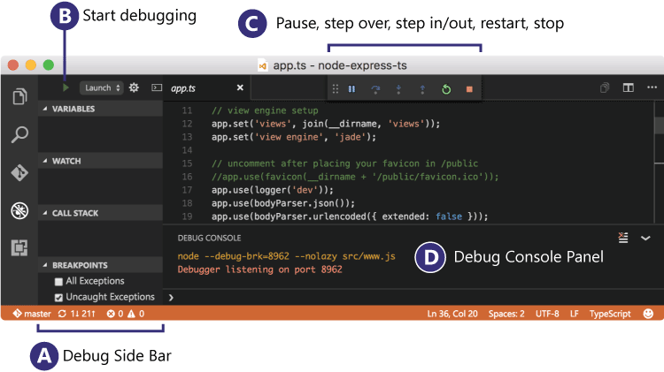
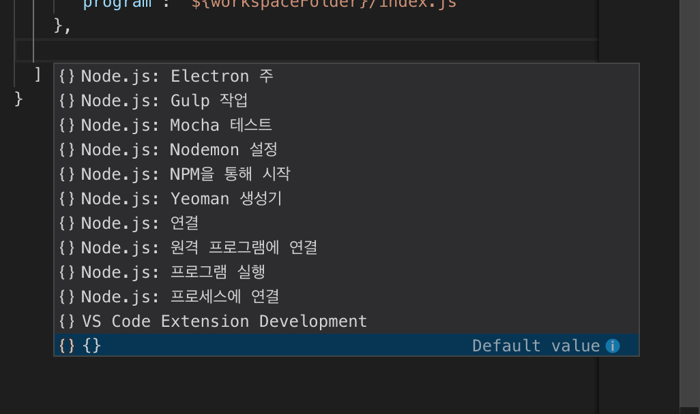
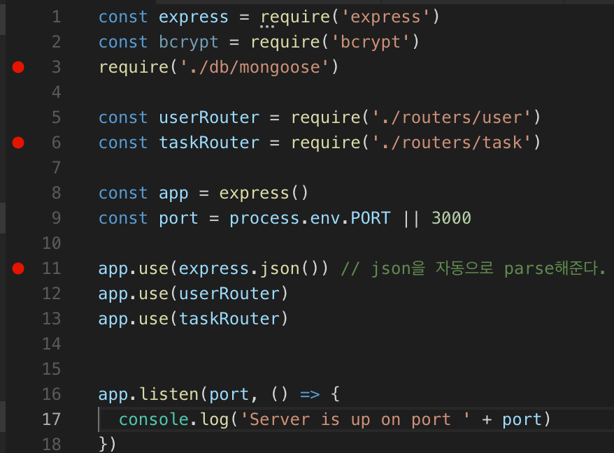
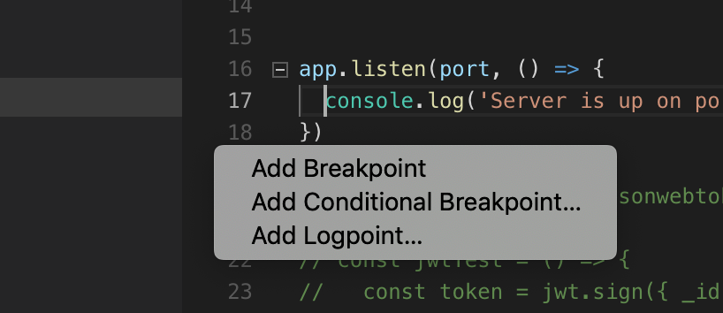
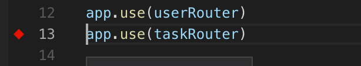
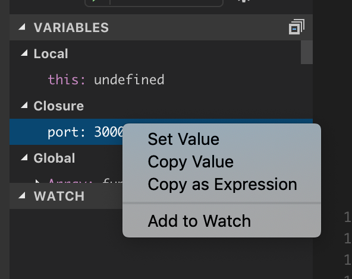

### 2019.04.05 Step 1-5


### Node.js 와 개발 환경


**핵심목표** : node.JS의 모듈방식 프로그래밍에 익숙해지고 Debugging을 배운다.


프로그래밍 언어들은 다양한 패러다임을 갖고 있다. 

- imperative (명령형)
  - **프로그래밍**의 상태와 상태를 변경시키는 구문의 관점에서 연산을 설명하는 **프로그래밍** 패러다임의 일종이다.
- declarative (선언적)
  - 해법을 정의하기보다는 문제를 설명
  - 명령형 **프로그래밍** 언어는 "어떤 방법"으로 할 것인지에 중점을 두는 반면에, **선언형 프로그래밍** 언어는 "무엇"을 할 것인지에 중점을 두고 있다.
- functional (함수형)
  - 자료 처리를 수학적 **함수**의 계산으로 취급하고 상태와 가변 데이터를 멀리하는 **프로그래밍** 패러다임
- event-driven(이벤트중심)
  - 어떤 일의 발생에 의해 특정 방향으로 가도록 된
  - 외부의 동작에 따라 기기 내부가 특정 코드를 선택, 그에 맞는 반응 행동을 보이도록 이끈다.


#### JavaScript는 어떻게 배울 수 있지?

API(Application Protocol Interface)는 다른 프로그래밍 간의 관계를 정의 하는 방법으로 알려져 있다.

라이브러리(library)의 경우 그 메서드(method)에 대한 설명을 API Documents라고 한다. 줄여서 API Docs라고 많이 부른다.

검색방법에 대한 몇 가지 노하우다.

- 영어권의 최신 버전의 문서를 본다.
- MDN이라는 사이트가 JavaScript에 대한 설명으로 유용하다.
- 메서드사용법(어떤 타입의 파라미터가 필수고, 옵션이지? 메서드는 어떤것을 반환하지?)을 정확히 알고 써야 한다.
- 영어 읽는게 어렵다면 example을 먼저 실행해보자.
- API Docs에서는 브라우저 지원(browser compatibility)범위에 대해서도 관심있게 보자.
- Stack overflow 사이트에 친숙하자.

----

#### NodeJS

NodeJS를 통해서 JavaScript를 브라우저 이외의 공간에서 실행할 수 있음. NodeJS는 v8엔진을 통해서. 동작됨.

ECMAScript문법에 따라서 구현가능. (ECMAScript는 JavaScript문법에 대한 명세)

NodeJS를 통해서 JavaScript코드를 CLI를 통해서 실행할 수 있음.

----

**IDE** (Integrated Development Environment)

----

xcode, atom, eclipse, vscode 등등..

인기있는 javascript IDE로는

- webstorm(jetbrain)
- komodo edit
- VScode
- atom
- brackets


### Online Editer

----

codepen.io, sandbox


## Debugging 정리

----

[VScode Debugging docs](https://code.visualstudio.com/docs/editor/debugging#nodejs-articles)


VScode의 buit-in debugger 사용




javascript, typescript 둘 다 debugging이 가능하다. 

디버깅에 대해서 읽기 전에 sample Application을 준비한다.


좌측에 Debug view를 누르거나, ⇧ + ⌘ + D  단축키를 활용한다.


**상단에 debug menu를 보면 다양한 메뉴들이 있다.**


### Launch Configurations

----

debug를 시작하기 위해 F5 를 누르면,  현재 파일에 대한 debug를 진행하려 시도한다. 대부분의 상황에서 .vscode라는 directory가 생성되고, 내부에 launch.json이 생성된다.  file system에서 직접 찾아도 되고,

IDE 의 메뉴를 눌러도 된다.


VScode는 자동적으로 debug 환경을 찾아내지만 실패했을 경우, 수동으로 골라줘야 한다.

```json
{
    "version": "0.2.0",
    "configurations": [
        {
            "type": "node",
            "request": "launch",
            "name": "Launch Program",
            "program": "program": "${workspaceFolder}/index.js"
        }
    ]
}
```

이는 launch.json 파일의 구조이며, 방금 실습한 결과 

타겟 file을 못찾아 낼 경우 program 의 value를 수정해줘야 한다.

> ⇧+⌘+E = file **E**xplorer view 


**IntelliSense suggestions** (⌃ + Space) 를 사용하여 특정 debugger에 어떤 attributes들이 있는지 찾아볼 수 있다. 모든 attribute들은 hover help에 나온다.

IntelliSense는 IntelliSense는  멤버 목록, 매개 변수 정보, 요약 정보 및 전체 단어를 포함하는 코드 완성 지원 도구이다.  


VScode에는 두가지 core debugging mode가 있다.

**Launch**와 **Attach**인데 이 두가지는 다른 workflow와 segment들을 다룬다. 

웹 개발자 도구에 익숙하면 attatch, 아니라면 launch


### Add a new configuration

launch.json 파일에 추가를 하는데, 

파일에서 IntelliSense suggestions를 사용하면



이처럼 다양한 옵션들을 보여준다.

또는 debug menu에서 Add Configuration 메뉴를 선택할 수 있다.


### Debug actions


debug session이 시작되면 이와 같은 debug toolbar가 상단에 등장하는데,

- Continue / Pause F5
- Step Over F10
- Step Into F11
- Step Out ⇧ + F11
- Restart ⇧ + ⌘ + F5
- Stop ⇧ + F5

순서대로 위와 같은 기능을 한다. 


### BreakPoints

----

breakpoint들은 editor margin을 클릭하거나 해당 라인에서 F9을 누르는 것으로 지정되고 해제될 수 있다. 

enable / disable / reapply와 같은 breakpoint control은 debug view의 breakpoints section에서 선택할 수 있다.




- breakpoint들은 이렇게 빨간 점으로 표시된다.
- 비활성화된 breakpoint들은 회색 점으로 표시된다.
- debugger change와 함께 등록될 수 없는 breakpoint들은 회색 도넛이 된다. debug session에서 live-edit기능 없이 source가 수정되면 똑같은 현상이 일어난다.

**Reapply All Breakpoints** 명령은 모든 breakpoint들을 기존 위치로 설정해준다. 


### Logpoints

----

Logpoint 는 breakpoint의 변형으로, break하지 않고 message를 console에 남기는 point이다. 

Logging을 debugging production server를 멈추지 않고 만들수 있는 편리함을 갖고 있다.







이렇게 빨간 다이아몬드 모양으로 표시된다. 

plain text 뿐만 아니라 expression도 넣을 수 있다. 

expression은 {}안에 작성해야 한다. 이는 특정 변수의 value를 알아내고자 할 때 유용하다. 


### Data inspection

----

variable들은 debug view의 variables section에서 검사할 수 있다. 

variable들은 variable's context menu의 set value action으로 조작될 수 있다. 




variable들과 expression들은 debug view의 watch section에서도 볼 수 있다 .


### Launch.json attributes

----

launch.json attribute들은 여러 debugger들과 debugging scenario들을 지원한다.

```json
"version": "0.2.0",
  "configurations": [
    {
      "type": "node",
      "request": "launch",
      "name": "프로그램 시작",
      "program": "${workspaceFolder}/debugTest.js",
      "cwd": "${workspaceRoot}"
    }
  ]
}
```

- type은 사용할 debugger의 타입을 의미한다. 여기서는 node
- request에는 launch와 attach가 지원된다.
- name은 사용자 지정


**Launch configurations와 관련된 options**

- `preLaunchTask` - Debug 전에 task를 미리 launch하는 option [tasks.json](https://code.visualstudio.com/docs/editor/tasks)(in the workspace's `.vscode` folder)

- `postDebugTask` - Debug이후에 task

  [tasks.json](https://code.visualstudio.com/docs/editor/tasks)(in the workspace's `.vscode` folder).

- `internalConsoleOptions` - debugging session중에 debug console panel이 보이도록 한다 

- `serverReadyAction` - if you want to open a URL in a web browser whenever the program under debugging outputs a specific message to the debug console or integrated terminal. For details see section [Automatically open a URI when debugging a server program](https://code.visualstudio.com/docs/editor/debugging#_remote-debugging) below. (뒷부분에서 다시 다룸)


**debugger에서 지원하는 attributes**

- `program` - executable or file to run when launching the debugger
- `args` - arguments passed to the program to debug
- `env` - environment variables (the value `null` can be used to "undefine" a variable)
- `cwd` - current working directory for finding dependencies and other files
- `port` - port when attaching to a running process
- `stopOnEntry` - break immediately when the program launches
- `console` - what kind of console to use, for example, `internalConsole`, `integratedTerminal`, or `externalTerminal`


**variable substitution**

- `${workspaceFolder}` 는 workspace root의 절대경로를 제공한다.

- `${file}` 는 활성화된 editor의 file을 가리킨다.
- `${env:Name}` 와 같이 환경 변수에 접근할 수 있다. 
-  [Variables Reference](https://code.visualstudio.com/docs/editor/variables-reference) 에서 위처럼 사용할 수 있는 변수들을 찾아볼 수 있고 IntelliSense를 이용해서 살펴볼 수도 있다.

```json
//example
{
    "type": "node",
    "request": "launch",
    "name": "Launch Program",
    "program": "${workspaceFolder}/app.js",
    "cwd": "${workspaceFolder}",
    "args": [ "${env:USERNAME}" ]
}
```


**platform-specific properties**

특정 os에 대해서 다른 설정을 지정해줄 수 있다.

```json
{
    "version": "0.2.0",
    "configurations": [
        {
            "type": "node",
            "request": "launch",
            "name": "Launch Program",
            "program": "${workspaceFolder}/node_modules/gulp/bin/gulpfile.js",
            "args": ["myFolder/path/app.js"],
            "windows": {
                "args": ["myFolder\\path\\app.js"]
            }
        }
    ]
}
```

위에서는 windows os에 대해서 args attribute를 다르게 지정할 필요가 있기 때문에 이처럼 작성할 수 있다.


**Global launch configuration**

User settings에서 launch 객체를 추가할 수 있다. 

 [settings](https://code.visualstudio.com/docs/getstarted/settings)에서 자세히 다룬다. launch configuration에 대해서 모든 나의 프로젝트들이 적용받도록 하는 것인데, 만약 특정 workspace에 대해서 launch.json이 존재한다면 위의 global setting은 무시된다. 


### 3가지 breakpoints


**Conditional breakpoints**

- expression condition : expression이 true일 경우에 breakpoint가 작동할 것이다. 
- Hit count: 반복문에서 일정 횟수 이후에 break가 잡히도록 하고 싶을 때 유용하다.

condition이나 hit count를 추가하고 싶으면, Add Conditional Breakpoint action을 선택해서 설정하거나 기존의 breakpoint에서 Edit Breakpoint action을 선택해서 설정한다. 


**Inline breakpoints**

- ⇧ + F9 으로 지정할 수 있고, 마우스로 직접 누르기만 해도 된다.
- 이해했던 일반적인 breakpoint와 비슷하고 
- line내에서 breakpoint를 지정할 경우 해당 instuction 바로 이전으로 break가 잡힌다.


**Funcion breakpoints**

- 특정 function name으로 breakpoint를 생성할 수 있다.
- source는 접근가능하지 않지만 function name은 알고 있는 경우 유용하다.


**Debug Console REPL(Read-Eval-Print-Loop)**

debug console(⇧ + ⌘ + Y)을 열고 console을 통해 기능을 사용할 수 있다.

만약 다중 줄을 입력해야한다면 ⇧ + ⏎를 하여 다음줄을 입력할 수 있다. 


### Multi target debugging

----

2개 이상의 process가 구동되는 복잡한 scenario들에서 multi-target debugging을 사용할 수 있다.

사용법은 간단하다

- 첫번째 debug session을 시작한 이후
- 다른 session을 그냥 시작할 수 있다.
- 두번째 session이 시작하면서 VScode UI는 multi-target mode로 전환한다. 

- call stack에서는 각각 분리된 session으로 보이게 된다.
- debug toolbar에서도 특정 session을 선택하여 조작할 수 있다.

multi target debugging을 위해서 Compoud launch Config.가 있다.

**launch.json**

```json
{
    "version": "0.2.0",
    "configurations": [
        {
            "type": "node",
            "request": "launch",
            "name": "Server",
            "program": "${workspaceFolder}/server.js",
            "cwd": "${workspaceFolder}"
        },
        {
            "type": "node",
            "request": "launch",
            "name": "Client",
            "program": "${workspaceFolder}/client.js",
            "cwd": "${workspaceFolder}"
        }
    ],
    "compounds": [
        {
            "name": "Server/Client",
            "configurations": ["Server", "Client"]
        }
    ]
}

```

server와 client에 대해한 설정과, compounds라는 attribute에서 그 둘을 묶어준다. 

Developing a web program typically requires opening a specific URL in a web browser in order to hit the server code in the debugger.

웹 개발에서는 웹브라우저에서 서버를 디버깅하는 순간 

특정 URL을 여는 것이 필요하다.

따라서 그 기능을 자동으로 해주는 것이 serverReady3Action이다.

```json
{
  "type": "node",
  "request": "launch",
  "name": "Launch Program",
  "program": "${workspaceFolder}/app.js",

  "serverReadyAction": {
    "pattern": "listening on port ([0-9]+)",
    "uriFormat": "http://localhost:%s",
    "action": "openExternally"
  }
}
```

해당 pattern이 등장하면 port number를 extract하고 uriFormat을 완성시킨뒤

action을 취한다. action은 openExternally 뿐만 아니라 debugWithChrome이란 옵션을 사용할 수 있다. 

chrome option을 사용하면 webRoot property를 chrome debug session에 넘겨줄 수 있다.


