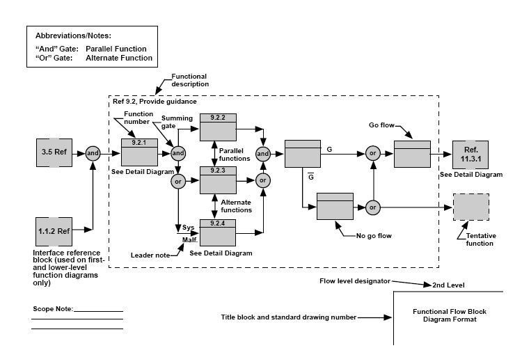
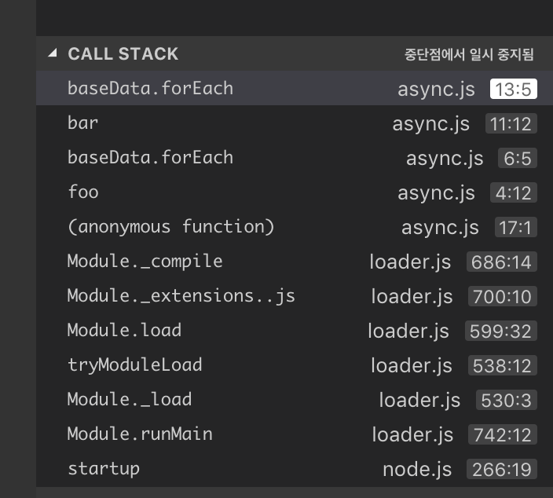
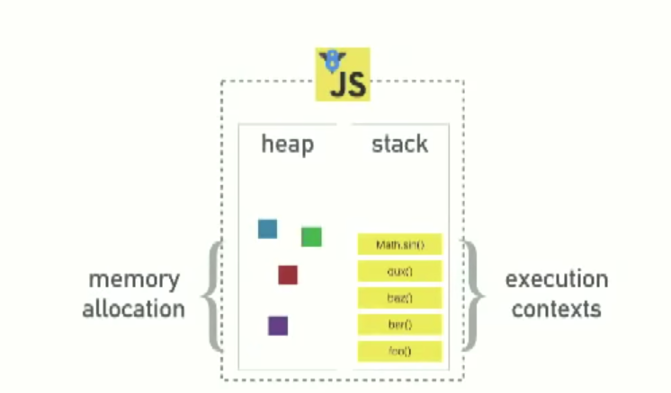

## javascript STEP 4 비동기 프로그래밍 기초

## 4-1 프로그래밍 디자인하기


프로그래밍 전에 코드를 디자인 하는 것은 중요하다.


프로그래밍 설계에는 다양한 방법이 있다.

- OOP프로그래밍에서는 class diagram을 그린다.
- 함수형 프로그래밍에서는 함수의 관계와 연결을 설계한다.


**Class Diagram 예시**


**Functional Flow Block Diagram**




**스캘레톤 코드**

말 그대로 전체 프로그램의 뼈대를 이루는 코드를 의미한다.

어떠한 function들에 대해 input과 output을 정하고, 어떠한 내부 기능이 있는지 주석으로 기록하는 등

**Pseudo 코드**

말 그대로 가짜 코드를 의미한다.


## 4-2 비동기 프로그래밍 기초


- 비동기 프로그래밍는 single thread로 동작하는 자바스크립트의 한계를 해결하는 방법중 하나이다.
- 데이터베이스에 접근하거나 네트워크 통신이 필요한 경우 등을 블록킹하지 않고 효과적으로 처리가능


동기(synchronous)

순서대로 실행된다. 직관적이다.


**동기적인 흐름의 예시**

```js
const baseData = [1,2,3,4,5,6,100];

function foo() {
  baseData.forEach((v,i) => {
    console.log("sync ", i);
    bar();
  });
}

function bar() {
  baseData.forEach((v,i) => {
    //debugger;
    console.log("sync 2", i);
  });
}

foo()
```

위 코드에서 debugger의 주석을 풀고 실행시켰을 때 실행결과에 대한 예측이 쉽고, call stack은 아래와 같이 나온다.




1. `foo()`가 먼저 실행되고, 
2. `foo()`내부의 `forEach`, 
3. 그다음 `forEach` 내부의 `bar()`
4. `bar()` 내부의 `forEach`가 실행된다.


**비동기 이해하기**

```js
function plus() {
  let a = 1;
  setTimeout( ()=>console.log(++a), 1000);
  return a;
}

const result = plus();
console.log('result :', result);  // result : 1
```

setTimeout 내부의 callback은 1000ms 뒤에 실행이 된다!

그럼 plus() function을 모두 다같이 기다릴 필요가 있을까?

없기 때문에 return a를 바로 실행하여 a에 1이 담긴 채로 날아가게 되고

result 출력까지 완료된 다음에야 callback이 실행되어 2가 된 a가 출력된다.


```js
const baseData = [1,2,3,4,5,6,100];

const asyncRun = (arr, fn) => {
 for(var i=0; i<arr.length; i++) {
   setTimeout( () => fn(i), 1000);
 }
}

asyncRun(baseData, idx =>console.log(idx));
```

1초씩 기다리며 출력하는게 아니라 

setTimeout 7개를 전부 다 던져버리고 각자 1초를 기다리는 것이기 때문에 거의 동시에 1초후 출력된다.


```js
const baseData = [1,2,3,4,5,6,100];

function sync() {
  baseData.forEach((v,i) => {
    console.log("sync ", i);
  });
}

const asyncRun = (arr, fn) => {
   arr.forEach((v,i) => {
     setTimeout( () => fn(i), 1000);
   });
}


function sync2() {
  baseData.forEach((v,i) => {
    console.log("sync 2 ", i);
  });
}

asyncRun(baseData, idx =>console.log(idx))
sync();
sync2();
```

1초는 컴퓨터에게 긴~ 시간이기 때문에 sync()와 sync2()가 순서대로 모두 출력된 후 약 1초 뒤에 asyncRun의 setTimeout의 callback이 실행된다.


자바스크립트의 런타임이란



### Blocking

- 그냥 느리게 수행되는 코드 

느린 동작이 stack에 남아있는 현상

AJAX가 동기적으로 작동한다면? AJAX 요청이 처리되는 동안 다른 것은 아무것도 할수가 없을 것이다. 네트워크 요청이 **blocking을 하고 있기 때문**


setTimeout은 callStack에 잠깐 등장했다가 사라진다.

그리고 5초뒤에 setTimeout의 callback이 마법처럼 등장하는데 어떻게 한 것일까?


webapis에 있는 setTimeout이기 때문에 webapis에서 타이머를 돌리고 있고, stack에선 setTimeout이 사라진다. 

타이머가 완료되면 task queue에 콜백을 집어넣는다.


**Event Loop**는 call stack과 task queue를 주시한다.

스택이 비어있고 task queue에 일이 있으면 stack에 넣어준다.

setTimeout( 0)은 stack이 비기까지 기다리도록 만들어주는 얍삽이


