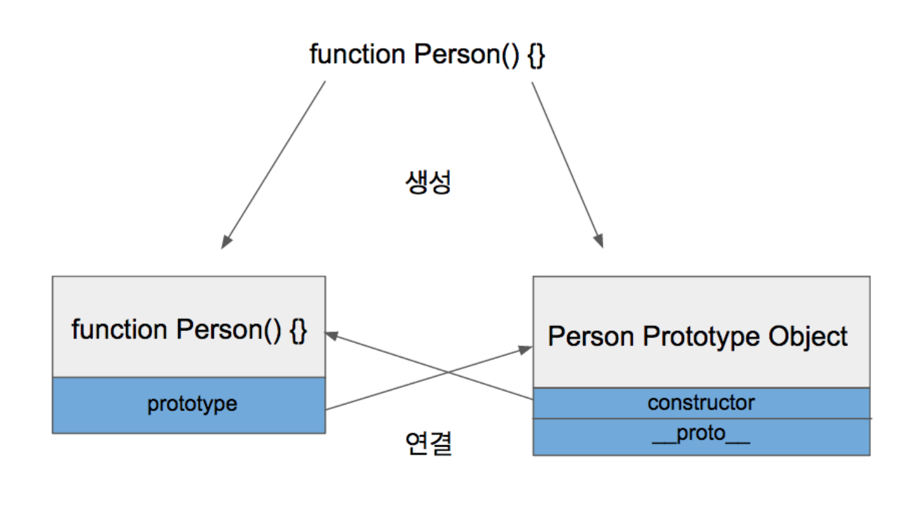

## 객체지향 프로그래밍

자바스크립트언어는 객체지향언어를 목적으로 만들어진 언어

Java나 C#같은 객체지향 프로그래밍 언어에서는 객체 생성을 필수로 하지만, 자바스크립트는 괜찮다.

자바스크립트에서는 객체지향과 함수형 프로그래밍 패러다임을 섞는 경우가 많다.

쉽게 수정할수 있다.

**추상적**

Class => 실체적인 무언가를 위해 필요한 기능, 속성들

property와 method


**실체적**

객체는 실체적이야


객체는 규모가 큰 프로젝트에서 효율성을 보여줘


### Prototype이란??(간단하게)

----

javascript는 사실 prototype 기반 언어이다.

클래스 대신 Prototype을 이용한다.


prototype에는 두가지 종류가 있다.

- **prototype object**

  객체는 언제나 function으로 생성된다.

  ```js
  function Dengdeng() {
    this.bark = () => {console.log('멍멍')}
    this.eyes = 2
    this.legs = 4
  } 
  var puppy = new Dengdeng(); // => 함수로 객체를 생성
  
  ```

```js
var obj = {};
// 이 코드는 사실 아래와 동일하다.
var obj = new Object();
```

함수가 정의될 때의 2가지 일 

1. 해당 함수에 Constructor(생성자) 자격 부여

constructor가 되면 new를 통해 객체를 만들어 낼 수 있게 된다.

2. 해당 함수의 prototype Object 생성 및 연결

함수와 함께 prototype 생성

prototype object는 constructor와 `__proto__`  를 갖고 있다.



- **prototype link**

```js
function Dengdeng() {
} // => 함수
  Dengdeng.prototype.bark = '왈왈'
  Dengdeng.prototype.eyes = 2 
  Dengdeng.prototype.legs = 4
var puppy = new Dengdeng(); // => 함수로 객체를 생성

console.log(puppy)
console.log(puppy.bark)
console.log(puppy.eyes)

// result
// Dengdeng {}
// 왈왈
// 2
```

puppy 내부에는 아무것도 없는데 어떻게 prototype object에 존재하는 것을 가져왔을까?

`__proto__` 가 그러한 것을 가능하게 해준다.

`__proto__` 는 모든 객체가 갖고 있는 속성이다.

객체가 생성될 때 조상이었던 함수의 Prototype Object를 가리킨다.


```js
console.log(puppy.__proto__)
// Dengdeng { bark: '왈왈', eyes: 2, legs: 4 }
```

__proto에 숨어있던 모습

객체가 직접 갖고 있지 않는 속성에 대해서 찾을 때까지 차례대로 상위 프로토타입을 탐색한다. 최상위에 위치한 Object의 prototype object까지 도달했는데 못찾으면 undefined를 리턴

이렇게 `__proto__` 를 통해 연결되어 있는 형태를 prototype chain이라고 한다.


이러한 구조 때문에 모든 객체는 Object의 자식이라 불린다.

Object Prototype object에 있는 모든 속성을 사용할 수 있다!

(ex) tostring() method사용가능


### Class

javascript는 class없이 프로그래밍이 가능하다. 또한 class가 존재하지만 함수가 클래스 역할을 한다고 볼 수 있다.

클래스 예시

```js
class DengDeng {
  constructor(name) {
      this.name = name;
  }
  sayName() {
      console.log(this.name + ' 안녕');
  }
}
let puppy = new DengDeng("구름이");
puppy.sayName();  
console.log(puppy instanceof DengDeng);     // true
console.log(puppy instanceof Object);          // true
console.log(typeof DengDeng);                    // "function"
console.log(typeof DengDeng.prototype.sayName);  // "function"
```


**Javascript 에서 function과 class는 First-Class Citizen이다.**

*일반적으로 다른 객체들에 적용 가능한 연산을 모두 지원하는 객체.*

*함수에 파라미터로 넘기기, 변수에 대입하기와 같은 연산들이 여기서 말하는 일반적인 연산의 예에 해당한다.*

**constructor**

- class안에 한개만 존재
- 부모 class의 constructor를 호출하기 위해 super 키워드 사용가능

**static**

- 정적 method 정의
- class의 instance화 없이 호출되며 class의 instance에서는 호출 불가능

```js
class DengDeng {
  constructor(name) {
      this.name = name;
  }
  get age() {
      return this.shootAge(this.name);
  }
  shootAge(name) {
      return name.length;
  }
  static dengPlus(dog1, dog2){
    return dog1.age + dog2.age
  }
}
var mongmong = new DengDeng('멍멍이')
var barkbark = new DengDeng('막시무스')
console.log(mongmong.age)
console.log(DengDeng.dengPlus(mongmong, barkbark))
```


### Encapsulation(캡슐화)

외부에 공개할 필요가 없거나 공개해서는 안되는 정보를 숨긴다. 필요한 것은 외부에 접근을 허용한다. private, public...

javascript도 최근 ES modules를 통해 접근제어가 된다

ES modules가 아니더라도 module pattern으로 private 자원 보호가 가능하다.

- 간단한 방법은 함수안에서 지역변수로 선언하는 것 


### Inheritance(상속)

extends 키워드를 사용하여 상속을 받는다.

**subclass에 constructor가 있다면, this를 사용하기 전에 super()를 호출한다.**

```js
class DengDeng {
  constructor(name) {
      this.name = name;
  }
  get age() {
      return this.shootAge(this.name);
  }
  shootAge(name) {
      return name.length;
  }
  static dengPlus(dog1, dog2){
    return dog1.age + dog2.age
  }
}
var mongmong = new DengDeng('멍멍이')
var barkbark = new DengDeng('막시무스')

class Jindodog extends DengDeng {
  constructor(name, barkSound){
    super()
    this.name = name
    this.barkSound = barkSound
  }
}
var jindol = new Jindodog('진돌이', '월월')

console.log(jindol.name)
console.log(jindol.barkSound)

```

상위 클래스의 method를 갖고 올 때 super를 붙인다.


```js
class Jindodog extends DengDeng {
  constructor(name, barkSound){
    super()
    this.name = name
    this.barkSound = barkSound
  }
  bark(){
    super.bark()
    console.log(this.barkSound)
  }
}
```


### Polymorphism(다형성)

- 특정 기능을 선언(설계, 명시)부분과 구현(동작)부분으로 분리한 후 구현부분을 다양한 방법으로 만들어 선택해서 사용할 수 있게 하는 기능
-  Javascript에서는 prototype chain 내에 동일한 method를 두고 overloading을 통한 메서드 중복 정의를 할 수 있다.
- interface도 없고, overloading을 공식지원하지 않는다.

여러가지 객체가 비슷한 역할을 하는 같은 이름의 method를 만들어 사용하는 경우 => **다형성**

자바스크립트에는 다형성을 지원한다는 가정하에 다형성스럽게 코드를 만든다.


### Abstraction(추상화)

필요성에 의해 있어야하는 정보들을 간추려서 구성하는 것

자바스크립트는 abstract class와 interface를 제공하지 않기 때문에 아래 3가지 패턴을 이용한다.

1. 리터럴
2. 함수활용
3. 프로토타입


**좋은 OOP란**

1. 역할과 책임

   역할 정의를 잘하고, 그 정의를 따른다.

2. 높은 응집도(high cohesion), 낮은 결합도(loose coupling)

   관련된 코드들은 항상 가까이, 서로에 대한 의존성은 최소화

   **유지보수를 위해**

3. **SOLID 원칙**

   - **Single Responsibility Principle**(SRP)

     단일 책임 원칙:  객체는 오직 하나의 책임을 가진다.

   - **Open-Closed Principle**(OCP)

     개방-폐쇄 원칙: 객체는 확장에 대해서 개방적이고, 수정에 대해서는 폐쇄적이어야 한다. 수정 대신 확장

   - **Liskov Substitution Principle**(LSP)

     리스코프 치환 원칙: 자식 클래스는 언제나 부모클래스를 대체할 수 있다.
     
   - **Interface Segregation Principle**(ISP)
   
     인터페이스 분리 원칙: 특정 클라이언트를 위한 인터페이스 여러 개가 범용 인터페이스 하나보다 낫다.
   
   - **Dependency Inversion Principle**(DIP)
   
     의존관계 역전 원칙: 프로그래머는 추상화에 의존해야지, 구체화에 의존하면 안된다.


객체는 원자적이어야 한다.

기존의 객체를 수정하기 보다 그 객체를 확장할 수 있게 해야한다.

자식클래스는 부모클래스의 모든 성질을 갖고 있어야 한다.

인터페이스는 분류에 따라, 여러개로 나눠서 수정과 확장이 용이하도록 한다.

의존성은 컴파일 단계가 아니라 런타임 단계에서 실현되도록 한다.

라고 이해해볼 수 있다.


### 참고문서

[prototype 출처](https://medium.com/@bluesh55/javascript-prototype-%EC%9D%B4%ED%95%B4%ED%95%98%EA%B8%B0-f8e67c286b67)

[class 출처](https://infoscis.github.io/2018/02/13/ecmascript-6-introducing-javascript-classes/)

[polymorphism 출처](https://webclub.tistory.com/406)

[SOLID 출처](https://ko.wikipedia.org/wiki/SOLID_(%EA%B0%9D%EC%B2%B4_%EC%A7%80%ED%96%A5_%EC%84%A4%EA%B3%84))