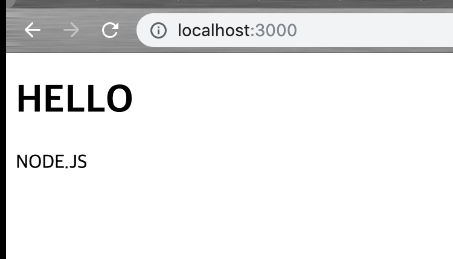
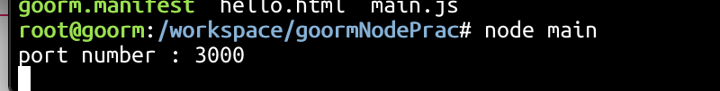

### 2019.04.02 Step 1-3


### SHELL

------

standard input을 받아 해당 프로그램을 실행시킨다.

process는 life cycle을 갖고 있다.


**unix기반 os의 기본 명령어들**

------

- `tree / -L 1` (tree [디렉토리이름] [-L 깊이])
- ` | ` : pipe

  - 앞 명령의 표준출력이 뒷 명령의 표준입력이 된다.
- `echo <인자>`   :  매개변수를 표준출력으로 보내주는 명령어이다.
- ` 'something1' > 'something2'` : redirection
  - something1의 표준 출력을 something2의 표준입력으로 사용한다. 그리고 something2의 기존 내용은 덮어쓰기 당한다.
  - `>>`  : 추가 모드로 사용할 수 있다.
- `cat` : 표준입력을 표준출력으로 보내주는 것.
  - `cat <파일명>` : 파일을 표준출력
  - `cat < '파일명'` : 파일의 내용을 표준입력으로 redirection해준다. 

- `ls` : 파일 리스트 출력

- `grep` : 표준입력 중에서 매개변수와 일치하는 것만 보여준다.

- `less <파일명>` (긴 파일의 내용을 끊어서 표시)

  - q : 종료
  - g : 처음으로
  - G : 끝으로
  - /단어 : 문서에서 '단어'를 검색
  - space, enter, 화살표, hjkl(vim이랑 똑같음) : 페이지 이동

- `history` : 명령어 이력 표시

- `cp <파일1> <파일2> ` : 파일1의 내용을 파일2에 copy

  - 다양한 옵션들은 여기로 [cp options](https://corej21.tistory.com/42)

- `mv <file or dir> <dir2>` : dir2로 이동

- `rm <file or dir>`  : 해당 file이나 dir 삭제 

  - -r : recursive option 하위항목 전체다 삭제(dir 삭제시 사용)
  - -f: forced option 관리자권한 강제 삭제

- `find <dir> -name "filename"`: 해당 filename을 해당 dir에서 찾아본다.

- `touch <filename>` : 0 byte file 생성

- `pbcopy` , `pbpaste` : 맥전용 명령으로 클립보드 복사/붙여넣기로 활용

  ex) 

  ```
  cat some.txt | pbcopy
  pbpaste > some2.txt
  ```

- 더 공부할래?

  - <https://opentutorials.org/course/2598>
  - <https://github.com/denysdovhan/bash-handbook/blob/master/translations/ko-KR/README.md>
  - <http://linuxcommand.org/lc3_learning_the_shell.php>
  - <https://linuxjourney.com/>
  - <https://www.edx.org/course/introduction-linux-linuxfoundationx-lfs101x-0>


### 로컬 환경 실습

```
$ node --version
v10.8.0
```

간단한 문장을 출력하는 html 파일을 작성한 후


**main.js**

```js
var http = require('http');
var fs = require('fs');
var app = http.createServer(function(request,response){
    var url = request.url;
    if(url == '/'){
      url = '/hello.html';
    }
    response.writeHead(200);
    response.end(fs.readFileSync(__dirname + url));
 
});
app.listen(3000, ()=>{
  console.log("port number : 3000")
});

```


`http.createServer([options][,requestlistener])`

- options에는 두가지
  - IncomingMessage, request로 들어온다.
  - ServerResponse,  response로 들어온다. 

- requestListener는 function이다. 

- method의 return 은 http.Server의 새로운 instance가 된다. 

  

`node main` 으로 실행시켜서 확인한 결과




### 서버 환경실습

**shh (Secure Shell)**

- 네트워크 상의 다른 컴퓨터에 로그인하거나 원격 시스템에서 명령을 실행하고 다른 시스템으로 파일을 복사할 수 있도록 해 주는 application 또는 protocol.


구름의 ssh 설정을 따라서 명령어를 입력해준다.

option p는 뒤에 port number가 따라붙으며 해당 포트로 연결하게 된다.

구름에서 제공하는 인증번호를 입력한뒤 로컬에서 진행했던 것과 동일하게 해준다.





### 회고

- 코드스쿼드

  배운 내용을 문서화하고 정리하는 것이 미숙한 것 같다. 조금 더 고민이 필요하다.

  모르는 부분에 대해서 좀 더 적극적으로 남들과 소통하겠다.

- 알고리즘

  학교에서 진행했던 대부분의 실습들을 c로 진행해왔지만 python을 배워야한다.

  알고리즘 풀이 과정에 대해 기록하고 남들과 비교하면 좋을 것 같다.

- node.js

  express에 의존하다 보니 직접 구현하는 것이 막막했다. 기본적인 원리에 대한 이해가 많이 필요하다.

- shell script

  가장 열심히 봤지만 활용에 대해 연습이 많이 필요하다는 것을 느꼈다.

- unix 명령어

  기존에도 shell을 많이 사용해왔지만 익숙한 기능들만 사용하고 있었다는 것을 크게 느꼈다.

  배운 것을 활용하도록 노력하겠다.

